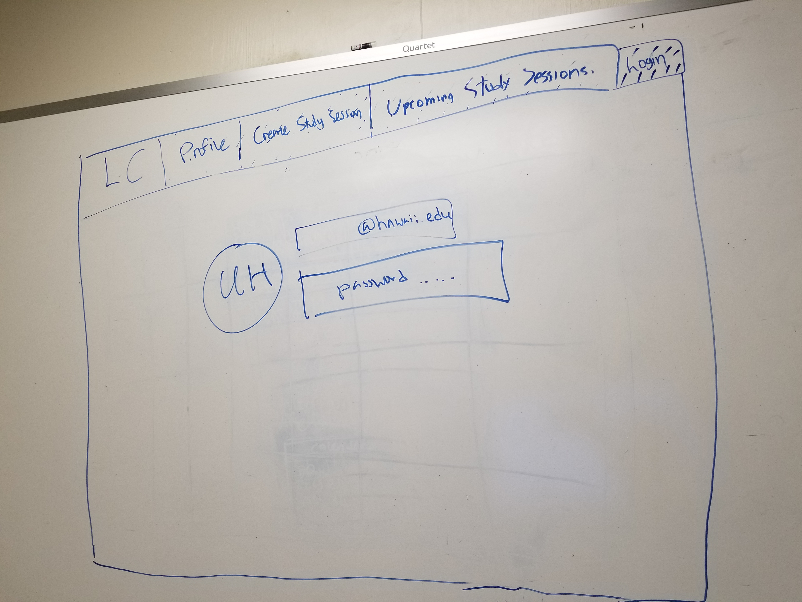
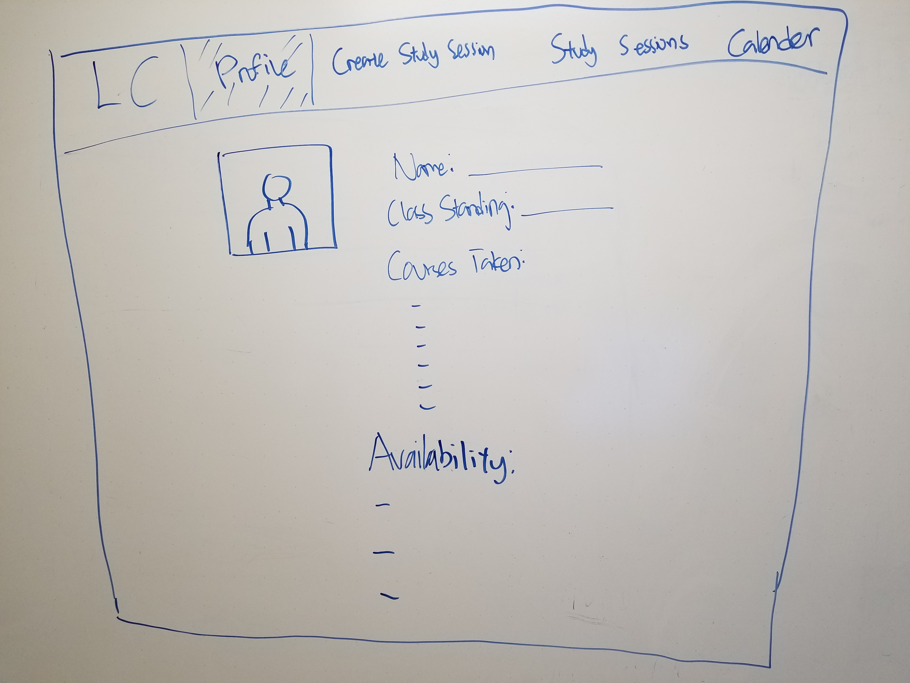
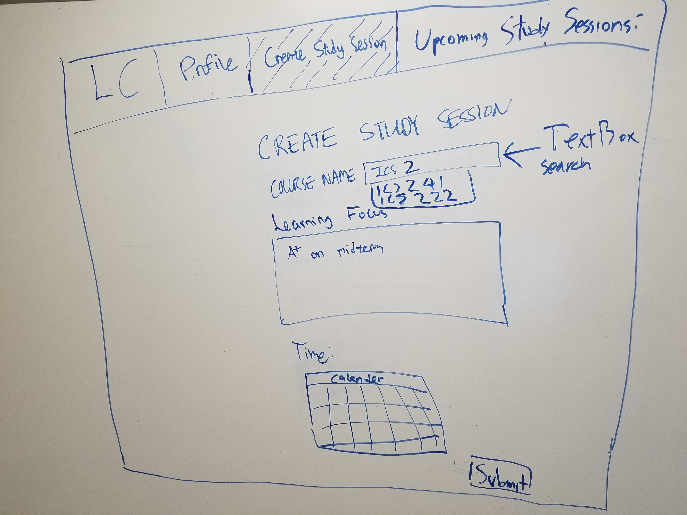

https://github.com/orgs/learningcomrades/projects/1
https://github.com/learningcomrades/LearningComrades

# Table of Contents

* [About Learning Comrades](#about-learning-comrades)
* [Mockup Pages](#mockup-pages)
  * [Landing Page](#landing-page)
  * [Login Page](#login-page)
  * [Profile Page](#profile-page)
  * [Create Study Session Page](#create-study-session-page)
  * [Upcoming Study Session Page](#upcoming-study-session-page)
* [Development Details](#development-details)
  * [Milestone 1](#milestone-1)
  * [Milestone 1](#milestone-2)
  * [Milestone 1](#milestone-3)
  

# About Learning Comrades

Learning Comrades is a Meteor application project created by Dallas Greene, Oliver Sou, and Collin Wong. The goal of this project 
is to provide the ICS undergraduate community a new way to learn and socialize.

# Mockup Pages

## Landing Page

## Login Page

## Profile Page

## Create Study Session Page

## Upcoming Study Session Page

# Development Details

